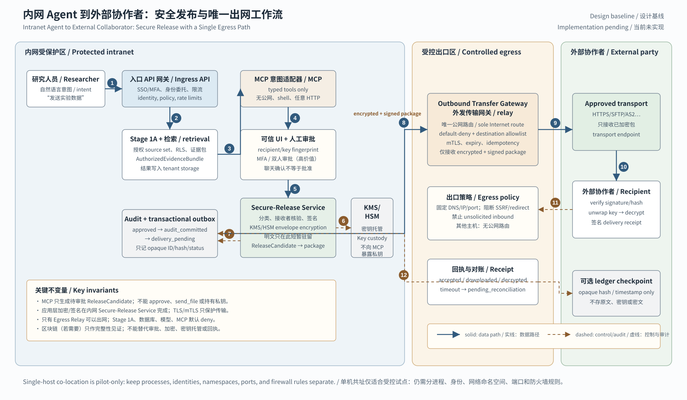

# 总体架构 / Architecture

## 1. 组织模型 / Organization Model

本仓库是 Git superproject，不是运行时应用，也不是把全部代码复制到一个目录的 monorepo。每个可独立验证和发布的组件保留自己的仓库；父仓库只固定经过审查的组件提交，并记录跨组件边界。

This repository is a Git superproject, not a runtime application or a monorepo containing copied source. Each independently testable and releasable component retains its own repository. The parent pins reviewed component commits and records cross-component boundaries.

```text
Industrial_Local_Agent
        |
        +-- components/stage1a-good-story-agent  [implemented, pinned]
        |
        +-- Tidy3D result adapter                [planned, not created]
        |
        +-- identity-aware retrieval service    [planned, not created]
        |
        +-- controlled model gateway            [planned, not created]
        |
        +-- secure release component             [planned, not created]
        |
        +-- workflow orchestrator                [planned, not created]
```

## 2. 当前组件 / Current Component

`components/stage1a-good-story-agent` 是当前唯一组件。它接收研究者明确选择的 TXT、Markdown、CSV、JSON 或可提取文本的 PDF，建立 SHA-256、来源定位和 evidence ID，再通过材料审计或本地 Ollama 生成受证据约束的暂定报告。

`components/stage1a-good-story-agent` is the only current component. It accepts researcher-selected TXT, Markdown, CSV, JSON, or text-extractable PDF inputs; builds SHA-256 values, source locators, and evidence IDs; then produces a provisional evidence-governed report through either material audit or local Ollama synthesis.

Stage 1A 不执行仿真、外部检索、云模型、自动代码、区块链或安全发布。形式正确的引用也不能证明科学解释正确，因此领域专家复核仍是强制步骤。

Stage 1A does not execute simulations, external retrieval, cloud models, generated code, blockchain, or secure release. Formally valid citations do not prove a scientific interpretation is correct, so domain-expert review remains mandatory.

父仓库当前固定 `4e3bdda`。子仓库的 Enterprise E1 工作建立 synthesis-provider contract，但在子 PR 合并并按版本更新规则单独更新 gitlink 前，它只是待审查实施，不是父仓库已固定能力。即使 provider contract 合并，它也仍只允许 audit 与回环 Ollama，不等于远端模型 gateway。

The parent currently pins `4e3bdda`. Enterprise E1 work in the child establishes a synthesis-provider contract, but it remains an implementation under review rather than a parent-pinned capability until the child PR is merged and the gitlink is updated through the version rules. Even after that provider contract merges, it still permits only audit and loopback Ollama and is not a remote model gateway.

## 3. Stage 1B 边界 / Stage 1B Boundary

Stage 1B 保留为下一项领域适配组件：只读 Tidy3D 结果适配器。当前代码实施先完成身份感知授权检索与安全发布基础的安全门槛，再开始该适配器。它把可信的公开或合成导出物转换为 Stage 1A 已支持的 JSON/CSV 边界，而不是把求解器权限加入写作 Agent。

Stage 1B remains the next domain-adapter component: a read-only Tidy3D result adapter. Current implementation first completes the security gates for identity-aware authorized retrieval and the secure-release foundation, then starts this adapter. It converts trusted public or synthetic exports into the JSON/CSV boundary already supported by Stage 1A instead of adding solver privileges to the writing agent.

```text
Tidy3D export
  manifest + simulation config + monitor data + notes
        |
        v
read-only adapter
  validate schema, units, provenance, grid, boundary, convergence metadata
        |
        v
Stage 1A evidence pipeline
  evidence-linked interpretation, limitations, next-step suggestions, draft text
```

适配器不得默认持有 Tidy3D API key、提交任务、执行模型生成代码或加载来自不可信来源的 pickle/Python 对象。优先使用有明确 schema 的 JSON 和 CSV。

The adapter must not hold a Tidy3D API key by default, submit jobs, execute model-generated code, or load pickle/Python objects from untrusted sources. Prefer schema-governed JSON and CSV.

## 4. 安全发布边界 / Secure-Release Boundary

安全发布组件属于后续阶段。设计顺序必须是：威胁模型、数据分类、接收者身份、加密、密钥管理、访问控制、签名、撤销和审计。只有当这些机制留下明确的多方记账问题时，才评估区块链。

The secure-release component belongs to a later stage. Its design order is threat model, data classification, recipient identity, encryption, key management, access control, signatures, revocation, and auditing. Blockchain should be evaluated only if those controls leave a concrete multi-party ledger problem.

原始科研数据不得写入区块链。若未来使用不可变账本，候选内容仅限经过评估的哈希、时间戳、授权或撤销事件。

Raw research data must never be written to a blockchain. If an immutable ledger is later justified, candidate records are limited to evaluated hashes, timestamps, authorization events, or revocation events.

## 5. 版本与更新规则 / Version and Update Rules

1. 子组件先完成自己的测试、敏感信息扫描、提交和推送。
   The child component first completes its own tests, secret scan, commit, and push.
2. 父仓库把 gitlink 更新到已存在于子仓库远端的具体提交。
   The parent updates its gitlink to a specific commit already present on the child remote.
3. 父仓库使用 `git diff --submodule` 审查版本变化，并单独提交该指针更新。
   The parent reviews the version change with `git diff --submodule` and commits the pointer update separately.
4. 协作者使用 `git clone --recurse-submodules` 或 `git submodule update --init --recursive` 恢复完整工作树。
   Collaborators restore the complete tree with `git clone --recurse-submodules` or `git submodule update --init --recursive`.

父仓库的 private 状态不会向子仓库传播权限，CI 也需要单独获得每个 private submodule 的最小读取权限。

The parent's private status does not propagate permissions to child repositories. CI also needs separate least-privilege read access to each private submodule.

## 6. 部署安全模型 / Deployment Security Model

当前 superproject 只组织代码版本，不提供操作系统级隔离。`/mnt/d` 的开发副本不能用于真实高价值数据。处理未公开材料前，应在 Linux 文件系统重新部署、限制文件权限、验证外发控制，并重新建立独立虚拟环境。

The current superproject organizes code versions only; it provides no operating-system isolation. The `/mnt/d` development copy must not handle real high-value data. Before processing unpublished material, redeploy on a Linux filesystem, restrict permissions, verify egress controls, and create a fresh isolated virtual environment.

## 7. Local 与 Enterprise 模式 / Local and Enterprise Modes

### 7.1 Local Mode / 本地模式

```text
researcher
    |
    v
loopback Web/CLI + startup token
    |
    v
Stage 1A service
    |
    +--> evidence audit
    |
    +--> loopback Ollama
    |
    v
private local run artifacts
```

Local mode 是当前实现。它是单用户、回环、明确上传材料的工作流；startup token 只防止同一浏览器会话的偶然访问，不是 user identity。它没有持久语料库、RAG、tenant isolation、SSO 或安全发布。

Local mode is the current implementation. It is a single-user, loopback workflow over explicitly uploaded material; the startup token prevents accidental access around one browser session but is not user identity. It has no persistent corpus, RAG, tenant isolation, SSO, or secure release.

### 7.2 Enterprise Target / 企业目标

```text
institutional user
    |
    v
SSO + trusted API gateway
    |
    v
DelegatedIdentityContext
    |
    v
retrieval gateway ----> policy service
    |                         |
    +-----------------> PostgreSQL/pgvector + forced RLS
    |
    v
AuthorizedEvidenceBundle
    |
    v
Stage 1A worker ----> controlled model gateway ----> registered provider
    |
    +-----------------> tenant result storage
    +-----------------> integrity-protected append-only audit
    |
    v
separate secure-release approval and encryption
```

Enterprise target 仍可在一个受控服务器上做小规模 pilot，但组件使用独立 service identity 和最小端口，只有入口 gateway 对用户开放。高并发、HA 或 Kimi K3 这类 cluster-class 模型需要把 GPU serving、数据库或 audit 拆到独立节点。单机与集群共享同一身份、授权和 evidence-bundle 契约。

The enterprise target can still run as a small controlled pilot on one server, but components use separate service identities and minimal ports, with only the entry gateway exposed to users. Higher concurrency, HA, or cluster-class models such as Kimi K3 require GPU serving, the database, or audit to move to separate nodes. Single-host and cluster deployments share the same identity, authorization, and evidence-bundle contracts.

secure-release 可以接收研究者从 tenant storage 中明确选择且获批的 raw/derived artifact，也可以接收 Stage 1A 输出；它不是只能由 Stage 1A 触发的下游步骤。任何输入都保持原 classification，并经过独立审批。

Secure release may accept researcher-selected and approved raw/derived artifacts directly from tenant storage or Stage 1A outputs; it is not a downstream-only Stage 1A step. Every input retains its classification and passes independent approval.

### 7.3 外发网关与 MCP 工作流 / External Egress Gateway and MCP Workflow

下图把入口身份网关和外发出口网关分成两个逻辑平面。MCP 位于内网控制平面，只把自然语言意图转换成受限的 typed API 请求；它不拥有公网路由、审批权、私钥或任意 HTTP/shell/filesystem 工具。`Secure-Release Service` 在受保护的内网边界内完成服务端分类、接收者公钥核验、人工审批绑定、应用层 envelope encryption 和签名；KMS/HSM 负责密钥托管。只有已经通过审计 outbox 的 `delivery_pending` 密文包可以交给 DMZ 出口 relay。

The figure separates the ingress identity gateway from the outbound egress gateway into two logical planes. MCP stays in the intranet control plane and translates natural-language intent into restricted typed API requests; it has no Internet route, approval authority, private keys, or arbitrary HTTP/shell/filesystem tools. The protected `Secure-Release Service` performs server-side classification, recipient-key verification, human-approval binding, application-level envelope encryption, and signing; KMS/HSM owns key custody. Only an audited `delivery_pending` ciphertext package may be handed to the DMZ egress relay.



这张图表达的最小流程是：研究者意图 → 入口认证 → Stage 1A/授权检索 → MCP 生成 `ReleaseCandidate` → 可信 UI 与 MFA/人工审批 → Secure-Release + KMS/HSM 加密签名 → audit-committed outbox → 唯一外发 relay → 获批的外部传输端点 → 分级签名回执与对账。TLS/mTLS 是传输层保护，不能替代包级加密；区块链（若未来有明确的跨机构见证需求）最多记录 opaque hash/timestamp，不存原文、密文、密钥或接收者隐私元数据。

The minimum workflow is: researcher intent -> ingress authentication -> Stage 1A/authorized retrieval -> MCP creates a `ReleaseCandidate` -> trusted UI and MFA/human approval -> Secure-Release + KMS/HSM encryption and signing -> audit-committed outbox -> sole outbound relay -> approved external transport endpoint -> signed, graded receipt and reconciliation. TLS/mTLS protects the transport layer but cannot replace package encryption. If a blockchain is later justified for cross-institution witnessing, it may record only an opaque hash/timestamp; it must not store plaintext, ciphertext, keys, or recipient-sensitive metadata.

在受控单机试点中，入口网关、MCP、Secure-Release 和 relay 可以物理共址，但必须使用独立进程/容器、service identity、网络命名空间、端口和 default-deny 防火墙规则。生产部署应优先把内网控制平面、Secure-Release/KMS 区和 DMZ egress relay 分开；Stage 1A、数据库、检索、模型和 MCP 均不得直接出网。当前图和规则是架构设计，相关安全发布和外发传输仍未实现。

In a controlled single-host pilot, the ingress gateway, MCP, Secure-Release, and relay may share hardware, but they still require separate processes/containers, service identities, network namespaces, ports, and default-deny firewall rules. Production should separate the intranet control plane, Secure-Release/KMS zone, and DMZ egress relay. Stage 1A, the database, retrieval, model, and MCP must not connect directly to the Internet. The figure and rules are design only; secure release and external transfer are not implemented.

## 8. 授权与模型责任边界 / Authorization and Model Responsibility Boundaries

| 边界 / Boundary | 权威控制 / Authoritative control | Defense in depth / 纵深控制 | 禁止的捷径 / Prohibited shortcut |
| --- | --- | --- | --- |
| Authentication / 认证 | Institutional IdP + gateway token validation / 机构 IdP 与 gateway token 校验 | MFA、short TTL、service identity | 客户端自报 user/tenant/role / Client-declared user/tenant/role |
| Authorization / 授权 | Server-side RBAC+ABAC policy / 服务端 RBAC+ABAC 策略 | PostgreSQL `FORCE ROW LEVEL SECURITY`、source reauthorization | LLM decision、RAG score 或 metadata filter / LLM decision, RAG score, or metadata filter |
| Retrieval / 检索 | Authorized source set, then ranking / 先授权 source set，再排名 | tenant index/cache isolation、bounded top-K | 全局检索后过滤 / Global retrieval followed by filtering |
| Synthesis / 综合 | Signed `AuthorizedEvidenceBundle` / 签名授权 evidence bundle | citation subset、schema/hash/expiry validation | Stage 1A 直连全局语料库 / Stage 1A direct access to the global corpus |
| Model invocation / 模型调用 | Registered provider and endpoint policy / 注册 provider 与 endpoint policy | mTLS、no proxy/redirect、digest provenance、no fallback | 模型选择 provider、调用外部工具或决定权限 / Model-selected providers, external tools, or access decisions |
| Release / 发布 | Human approval + cryptographic secure-release component / 人审与密码学安全发布组件 | recipient verification、signature、revocation、audit | 把 export ZIP 或 private GitHub 当作安全传输 / Treating an export ZIP or private GitHub as secure transfer |

核心不变量是：RAG performs relevance retrieval, never authorization; the LLM never decides access。vector search 只能在数据库与策略已经允许的 source set 内运行，top-K source 在进入 prompt 前重新授权。

The core invariant is: RAG performs relevance retrieval, never authorization; the LLM never decides access. Vector search runs only inside a source set already permitted by policy and the database, and every top-K source is reauthorized before entering a prompt.

## 9. 跨组件契约与失败策略 / Cross-component Contracts and Failure Policy

Enterprise E0 定义五个稳定边界：

Enterprise E0 defines five stable boundaries:

1. `DelegatedIdentityContext`：gateway 生成、签名、短期有效，并绑定 subject、tenant、purpose、audience 和 policy version。
   `DelegatedIdentityContext`: gateway-derived, signed, short-lived, and bound to subject, tenant, purpose, audience, and policy version.
2. `AuthorizedEvidenceBundle`：retrieval service 在 source-level reauthorization 后生成，包含 immutable source/version/hash、bounded evidence 和 authorization decision ID。
   `AuthorizedEvidenceBundle`: generated after source-level reauthorization, containing immutable source/version/hash, bounded evidence, and authorization decision IDs.
3. Synthesis provider contract：在接触 evidence 前声明 capability，调用后返回真实 provider/model/endpoint/transport provenance，失败时不 fallback。
   Synthesis provider contract: declares capabilities before receiving evidence, returns truthful provider/model/endpoint/transport provenance, and never falls back after failure.
4. Audit event：只记录 opaque identity、resource ID、policy/decision、hash、provider 和状态；不记录科研正文、prompt、embedding、reasoning、token 或完整输出。audit sink 返回绑定 stream/sequence、previous/event hash、key/signature 的完整性 receipt。安全发布只有收到并保存该 receipt 后才能进入 delivery outbox，并使用幂等状态机处理结果对账。
   Audit event: records only opaque identity, resource IDs, policy/decision, hashes, provider, and status; never research content, prompts, embeddings, reasoning, tokens, or full outputs. The audit sink returns an integrity receipt bound to stream/sequence, previous/event hashes, and key/signature. Secure release enters the delivery outbox only after receiving and persisting that receipt, then uses an idempotent state machine for outcome reconciliation.
5. Secure-release contract：研究者显式选择 raw/derived/Stage 1A artifact 构成 release candidate；独立组件输出签名加密包、验证/解密说明和绑定接收者/package hash 的 receipt。Agent 不能降低数据分类、批准外发或承诺已解密数据可撤回。
   Secure-release contract: the researcher explicitly selects raw, derived, or Stage 1A artifacts for a release candidate; an independent component emits a signed encrypted package, verification/decryption instructions, and a receipt bound to the recipient and package hash. The agent cannot lower data classification, approve release, or promise recall of decrypted data.

identity、policy、RLS、bundle signature/expiry、provider preflight 或 mandatory audit 任一失败都必须停止请求。不得切换到全局搜索、另一个 tenant、未注册 provider、云 API 或无审计模式。

Any identity, policy, RLS, bundle signature/expiry, provider preflight, or mandatory-audit failure stops the request. The system must not switch to global search, another tenant, an unregistered provider, a cloud API, or an unaudited mode.

字段级契约、威胁测试、数据生命周期、Kimi K3 边界和 E2-E4 验收门槛见 [企业部署与威胁模型](ENTERPRISE_DEPLOYMENT.md)。Enterprise、安全发布和 Stage 1B 在架构与 Issue 边界上相互独立，但当前实施优先身份/授权检索与安全发布基础，Tidy3D adapter 随后开始；不得把身份/RAG 逻辑写入 adapter，也不得把仿真执行权限加入 Stage 1A。

See [Enterprise Deployment and Threat Model](ENTERPRISE_DEPLOYMENT.md) for field-level contracts, threat tests, data lifecycle, Kimi K3 boundaries, and E2-E4 acceptance gates. Enterprise, secure release, and Stage 1B retain separate architectural and Issue boundaries, but current implementation prioritizes identity/authorized retrieval and the secure-release foundation before the Tidy3D adapter. Identity/RAG logic does not enter the adapter, and simulation-execution privilege does not enter Stage 1A.
